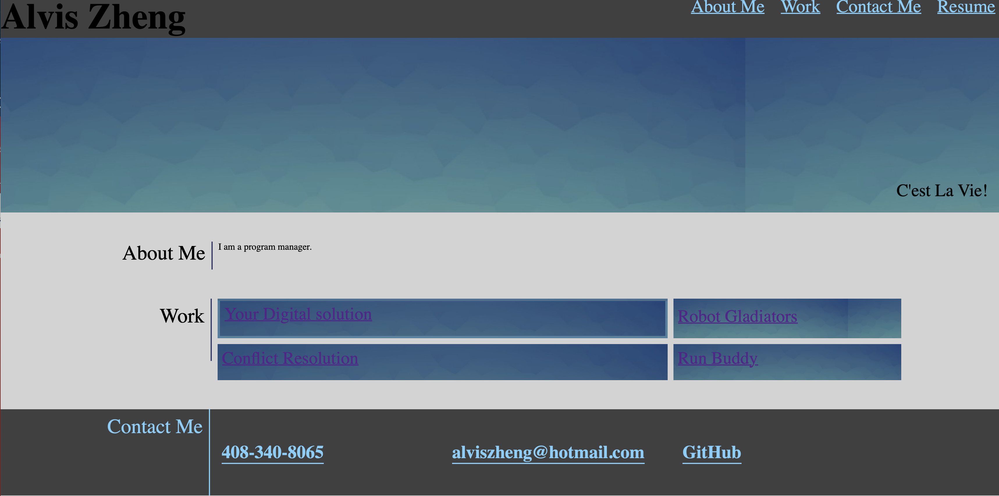

# Professional Portfolio

Professional portfolio of work samples for future job hunting.

## Objective

* Sample a potential employee's professional portfolio including name, photo and contact information
* Links take the user to the corresponding section
* Project is linked directly to the applications
* Responsive layout that adapts to my viewport

### HTML codebase refactoring

* HTMl structure
    * < Head >
    * < Body>
        * < Header >
        * < Hero >
        * < Article > 
    * < Footer >

### CSS codebase

* Flexbox, media queries, and CSS variables
* CSS structure, table of contents
    * 1.0 - Global variable definitions
    * 2.0 - Header
    * 3.0 - Body
    * 4.0 - Footer
    * 5.0 - Hover effects
    * 6.0 - Hero section
    * 7.0 - Flex grid
        *	7.1 - Flex grid body about me
        *	7.2 - Flex grid body work
        *	7.3 - Flex Grid Footer
    * 8.0 CSS Span

## Github deployment

* Github repository URL: https://github.com/alviszheng/professional-portfolio
* Github page URL: https://alviszheng.github.io/professional-portfolio/